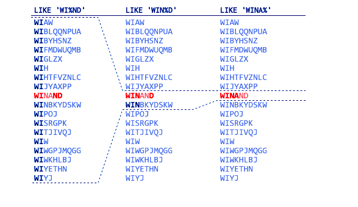
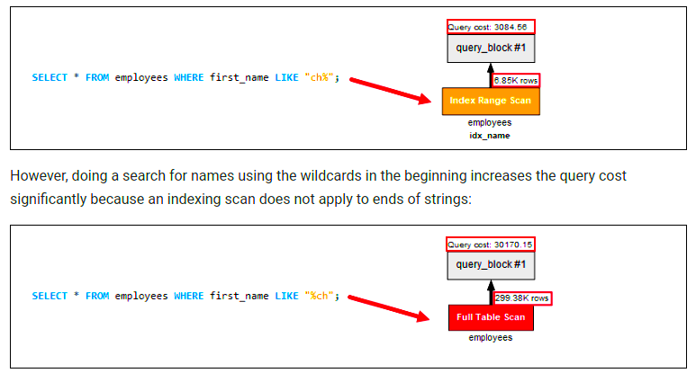

# MySql Performance Tips

### 1. Beware of indexed column datatype

Please use the same datatype of the indexed column in your application

For example

Consider you have a mobile_number column with `varchar` datatype in users table,

```sql
SELECT * FROM users WHERE mobile_number = 9876543210
```

the above sql query won't use the index of the `mobile_number` column, due to datatype mismatch. We have a `varchar` type in the database but executing the query with a `big integer` in the application.

Execute the query with the `string` datatype is the solution to use the proper index

```sql
SELECT * FROM users WHERE mobile_number = "9876543210"
```

### 2. Composite index strategy

A composite index is an index on multiple columns. MySQL allows you to create a composite index that consists of up to 16 columns.

A composite index is also known as a multiple-column index.

The query optimizer uses the composite indexes for queries that test all columns in the index, or queries that test the first columns, the first two columns, and so on.

If you specify the columns in the right order in the index definition, a single composite index can speed up these kinds of queries on the same table.

To create a composite index at the time of table creation, you use the following statement:

```sql
CREATE INDEX index_name ON table_name(c1,c2,c3);
```

Notice that if you have a composite index on `(c1,c2,c3)`, you will have indexed search capabilities on one of the following column combinations:

```
(c1)
(c1,c2)
(c1,c2,c3)
```

```sql
SELECT * FROM table_name WHERE c1 = v1;
SELECT * FROM table_name WHERE c1 = v1 AND c2 = v2;
SELECT * FROM table_name WHERE c1 = v1 AND  c2 = v2 AND c3 = v3;
```

The query optimizer cannot use the index to perform lookups if the columns do not form the leftmost prefix of the index. For example, the following queries cannot use the composite for lookups:

```sql
SELECT * FROM table_name WHERE c2 = v2;
SELECT * FROM table_name WHERE c3 = v3;
SELECT * FROM table_name WHERE c1 = v1 AND c3 = v3;
```

### 3. BLOB and TEXT columns

BLOB and TEXT columns also can be indexed, but a `prefix length` must be given.

Example

```sql
CREATE INDEX foo_bar_idx ON foo (bar(500));
```

If possible please use `varchar` type rather using TEXT

Versions of MySQL after `5.0.3` can store up to `65535` chars in a VARCHAR (However you cannot store more than 65535 bytes in a single row).

### 4. Specify the necessary columns in the SELECT statements

Try to avoid using the `SELECT * FROM` as it retrieves all the columns of the table and thus causes the additional load on the server and slows down its performance. Make it a rule to always specify the columns in the SELECT statements.

### 5. Avoid using wildcards at the beginning of LIKE patterns

MySQL queries with LIKE operators often lead to the server performance downturn so they should be used carefully. MySQL can not use indexes when the LIKE pattern starts with a wildcard, for example, `'%xyz'`, and performs a `full table scan` in this case. You should bear this in mind when optimizing MySQL queries and try using `'xyz%'` instead whenever possible.




### 6. Use INNER JOINs instead of OUTER JOINs

Use OUTER JOIN only when necessary. MySQL does much more work fetching the results for OUTER JOINs as compared to INNER JOINs. We recommend you to check the performance of your JOIN queries and in case it is not satisfying—start converting your OUTER JOINs into INNER JOINs when possible. MySQL JOINs optimization can lead to dramatic performance improvement.

### 7. Use ORDER BY Appropriately

The `ORDER BY` expression sorts results by the specified column. It can be used to sort by two columns at once. These should be sorted in the same order, ascending or descending.

If you try to sort different columns in different order, it will slow down performance. You may combine this with an index to speed up the sorting.

### 8. Avoid using functions in predicates

Avoid using a function in the predicate of a query.

For example:

```sql
SELECT * FROM MYTABLE WHERE UPPER(COL1)='ABC'
```

Because of the `UPPER()` function, the database doesn’t utilize the index on COL1. If there isn’t any way to avoid that function in SQL, you will have to create a new function-based index or have to generate custom columns in the database to improve performance.

### 9. Use the EXPLAIN Function

Appending the `EXPLAIN` expression to the beginning of a query will read and evaluate the query. If there are inefficient expressions or confusing structures, `EXPLAIN` can help you find them. You can then adjust the phrasing of your query to avoid unintentional table scans or other performance hits.

### 10. Use DISTINCT and UNION only if it is necessary

Using UNION and DISTINCT operators without any major purpose causes unwanted sorting and slowing down of SQL execution. Instead of UNION, using UNION ALL brings more efficiency in the process and improves MySQL performance more precisely.

### 11. Beware of using whereDate eloquent method of laravel

If you have an index for created_at column of your users table, then
```sql
SELECT * FROM users where date(created_at) = '2023-05-08'
```
Will not use the created_at column index. But,

```sql
SELECT * FROM users where created_at = '2023-05-08'
```
Will use the created_at column index.

Whatever the datatype of created_at column(date or datetime), the whereDate method won't use the MySql index

### 12. Avoid using function in predicates

Let's say we have a table called users with columns `id`, `name`, and `age`. We want to retrieve all users older than 30 years. Here's an example of using a function in a predicate:

```sql
SELECT * FROM users WHERE YEAR(CURRENT_DATE()) - YEAR(birthdate) > 30;
```
In the above query, the YEAR() function is used in the predicate to calculate the age based on the birthdate. To optimize this query and avoid using a function in the predicate, we can modify it as follows:

```sql
SELECT * FROM users WHERE birthdate < DATE_SUB(CURRENT_DATE(), INTERVAL 30 YEAR);
```
In this modified query, we avoid using the YEAR() function directly in the predicate. Instead, we use the DATE_SUB() function to calculate the date 30 years ago and compare it with the birthdate column directly. By avoiding functions in predicates, you can improve the query's performance as it allows the database to utilize indexes efficiently and optimize the query execution plan.

### Wrapping up! 🙏

This article provides in detail, the account of the best practices for database optimization and handy MySQL performance tuning tips every developer must know. It’s a complete guide for those backend devs, who are uncertain about their poor database performance and need some handy techniques to optimize MySQL database from the core.

If you want to add your thoughts on the topic or want to ask some questions regarding it, feel free to contact me. If you do any changes please add the version number with date

### USEFUL LINKS
https://dudi.dev/optimize-laravel-database-queries/

---
Author : $\textcolor{HotPink}{Vijayakumar}$

- Version 1.0 is created on 04-01-2023

